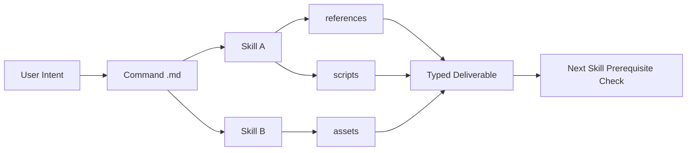

# Research: financial-services-plugins 的组合式分析体系

日期：2026-02-26  
仓库：`/Users/qinghuan/Documents/code/financial-services-plugins`

## 1. 一句话结论

这个仓库的核心不是“用一个大脚本跑到底”，而是把复杂金融分析拆成可验证的能力单元（command/skill/reference/script），通过显式依赖和产物契约在多轮会话中逐步组装，形成可审计、可替换、可扩展的组合式工作流。

## 2. 当前链路怎么跑（代码链路分层）

### 2.1 注册与发现层（Marketplace / Plugin）

- `.claude-plugin/marketplace.json` 统一注册多个插件（core + add-on + partner-built）。
- 每个插件的 `.claude-plugin/plugin.json` 只描述元信息，不写业务逻辑。
- 连接器配置与业务逻辑分离，集中在各插件 `.mcp.json`（例如 `financial-analysis/.mcp.json` 提供 11 个数据源）。

### 2.2 编排层（Commands）

- `commands/*.md` 负责“入口与路由”：
  - 接受用户参数
  - 决定调用哪个 skill（有时是多个 skill）
  - 规定高层步骤与交付物
- 典型例子：`financial-analysis/commands/dcf.md`
  - 先 `comps-analysis`
  - 再 `dcf-model`
  - 最后做交叉校验并输出

### 2.3 能力层（Skills）

- `skills/*/SKILL.md` 负责“领域方法论 + 质量门槛 + 输入输出契约”。
- skill 不是函数库，而是“可执行规约”：
  - 触发条件
  - 严格流程
  - 失败分支（输入不满足时中止/回退）
  - 交付物边界（只交付指定文件类型）

### 2.4 深度上下文与确定性层（references / scripts / assets）

- `references/`：按需加载的深度知识（避免主 skill 过长）。
- `scripts/`：高确定性任务下沉到脚本（如数值提取、模型校验）。
- `assets/`：模板/清单等复用资产。
- 这正是 `financial-analysis/skills/skill-creator/SKILL.md` 明确强调的 progressive disclosure 设计。

### 2.5 运行图（抽象）

## 3. 它如何完成复杂任务（不是硬组合脚本）

复杂任务通过“跨回合 DAG + 强约束节点”完成，而不是“单脚本一次性串行”。

### 3.1 关键机制

1. **显式依赖**：后续任务必须验证前置产物存在（文件路径、格式、内容）。
2. **单任务原子化**：一个 skill 一次只做一个明确节点，减少上下文污染。
3. **类型化产物**：`.md / .xlsx / .zip / .docx` 是节点间接口。
4. **质量门控**：关键节点带校验规则与脚本，不满足就不进入下一步。
5. **可替换组合**：command 可替换 skill，skill 可替换工具来源（优先 MCP）。

### 3.2 与硬脚本的差异

| 维度 | 硬组合脚本 | 当前仓库模式 |
|---|---|---|
| 流程结构 | 固定串行、改动成本高 | 声明式组合，命令/技能可替换 |
| 依赖管理 | 隐式（靠代码约定） | 显式 prerequisite 检查 |
| 失败处理 | 常见“跑挂后重来” | 在节点边界中止并提示补齐 |
| 可审计性 | 日志难映射业务步骤 | 每步规则与产物都可追踪 |
| 扩展方式 | 改主脚本风险高 | 增加新 command/skill 即可 |
| 人机协作 | 自动化强但不透明 | 可在每个节点人工审阅后继续 |

## 4. 具体例子：它如何做“组合分析”

### 4.1 例子 A：`/dcf` 的双 skill 组合

证据文件：
- `financial-analysis/commands/dcf.md`
- `financial-analysis/skills/comps-analysis/SKILL.md`
- `financial-analysis/skills/dcf-model/SKILL.md`
- `financial-analysis/skills/dcf-model/scripts/validate_dcf.py`

执行逻辑：
1. `/dcf` 先触发 comps，输出 peer multiples / growth / margin 基准。
2. 再触发 dcf-model，把 comps 中位数与分位区间注入终值倍数和敏感性区间。
3. 进行 implied multiple cross-check（DCF 结果反推与 comps 对比）。
4. 输出两个文件系：comps 表 + DCF 模型。
5. 用校验脚本检查公式错误、WACC 合理性、Terminal Value 占比。

本质：这是“分析组合”（comps 约束 DCF 假设 + DCF 反校验 comps），而不是“先后执行两个无关脚本”。

### 4.2 例子 B：`initiating-coverage` 的跨任务组合

证据文件：
- `equity-research/commands/initiate.md`
- `equity-research/skills/initiating-coverage/SKILL.md`
- `equity-research/skills/initiating-coverage/references/task*.md`

关键点：
1. skill 强制 **one-task-at-a-time**，拒绝“一次跑完 5 步”。
2. Task3/4/5 明确依赖 Task2 或前序全部产物。
3. 每个任务只允许指定 deliverable（例如 Task2 只交 `.xlsx`）。
4. 通过“验证-执行-交付-等待下一请求”形成跨轮次 DAG。

这让复杂研究报告被拆成可检查、可回滚、可并行准备（Task1 与 Task2 可并行）的系统，而不是一段巨型脚本。

## 5. Skill 设计哲学（可学习的理念）

### 5.1 设计哲学

1. **声明式优先**：把“做什么/为什么/边界”写进 Markdown 规约，而不是埋进代码细节。
2. **渐进披露（Progressive Disclosure）**：默认只加载最小上下文，深内容按需读取 `references/`。
3. **自由度分级**：高变任务用文本策略，脆弱步骤下沉 `scripts/`，在灵活性与确定性间取平衡。
4. **产物即接口**：文件类型和命名就是跨步骤 API，天然支持人工审阅和审计。
5. **数据平面与控制平面分离**：MCP 连接器独立于 workflow，便于替换数据源而不重写流程。
6. **失败前置**：先验验证（prerequisite gate）优先于“先跑再报错”。

### 5.2 能直接借鉴的实践

1. 先定义任务 DAG，再写每个节点的输入/输出契约。
2. command 只做路由，skill 承载方法与质量标准。
3. 大 skill 拆 references；高风险步骤给脚本与校验器。
4. 输出文件类型固定化，减少跨步骤歧义。
5. 每个节点都给“停止条件”和“下一步条件”。
6. 把“只交付指定产物”写成硬规则，防止上下文噪声。

## 6. 对本仓库的观察与建议

### 6.1 观察

- 当前仓库统计（本地扫描）：`53` 个 skills、`47` 个 commands、`5` 个 hooks。
- README 的 “41 skills, 38 commands” 可能是历史数字，建议同步更新。

### 6.2 建议

1. 增加一个全局“workflow catalog”（每个 command 的依赖图与产物表）。
2. 给关键 skill（如 dcf/initiating-coverage）补统一 machine-readable 契约（例如 YAML I/O schema）。
3. 在 `hooks/` 增加自动校验触发点（例如交付前自动跑 validator）。

## 7. 结语

这个仓库最值得学的不是金融模板本身，而是其“组合式系统观”：
用可读规则管理复杂性，用显式依赖管理风险，用类型化产物管理跨步骤协作。
这套方法可以迁移到任何复杂知识工作流（法务、咨询、审计、医疗文书）中。
